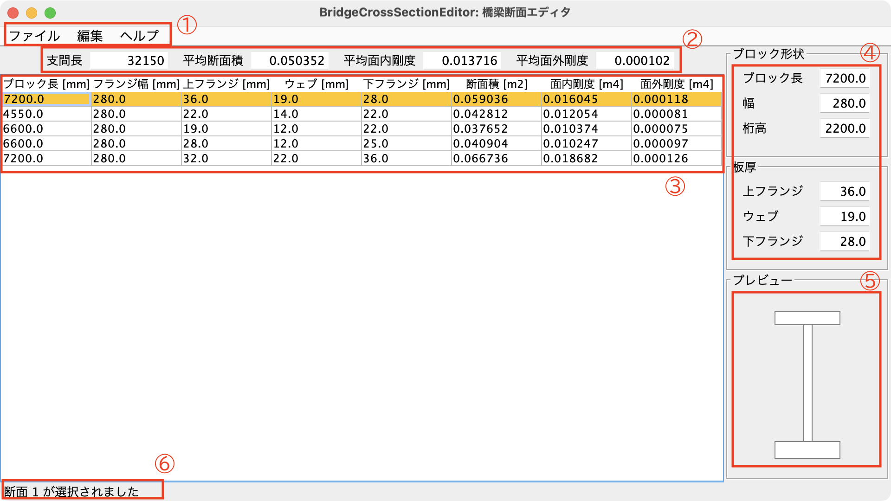
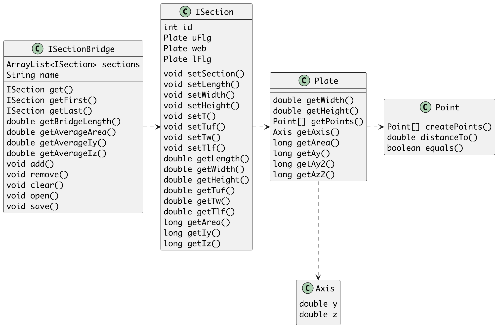

# BridgeCrossSectionEditor: 橋梁断面エディタ

## 概要

橋梁断面（幅、桁高、板厚）をブロック単位で入力し、断面諸元（断面積、剛度）を算出するプログラム

（東京電機大学 情報メディア学科 2024年度 GUIプログラミング の最終レポートとして制作しました）

## 機能

- 橋梁の平均断面情報を表示する
- 断面のプレビュー表示
- 断面ブロックの追加・削除
- 橋梁断面をTXTファイルとして保存
- 保存したファイルを開く

## 画面構成および使用方法

1. メニューバー
   - ファイル -> 開く、保存、終了
   - 編集 -> 行の挿入、行の削除
   - ヘルプ -> このアプリについて
2. 平均断面情報パネル
   「支間長」「平均断面積」「平均面内剛度」「平均面外剛度」を表示する。
   これらの値は、断面の変更に応じて自動的に更新される。
3. 一覧テーブル
   ブロック毎に断面寸法（桁高、板厚など）および断面諸元（断面積、剛度）を一覧する。
   行を選択後、断面入力パネルで断面を変更すると、この一覧テーブルに情報が反映される。
   また、断面諸元は断面の変更に応じて自動で算出される。
4. 断面入力パネル
   ブロック形状および板厚の入力を行う。
   一覧テーブルで選択されたブロック断面が対象となる。
5. プレビューパネル
   選択中の断面図をイメージ図として確認できる。
   ブロック毎の断面の比較を目的としているため、板厚に対する桁高および幅は正確ではない。
6. ステータスバー
   選択中の断面番号が表示される。
   また、ファイル操作時の結果が表示される。

## ツールのポイント

(1) 橋梁の鈑桁断面情報を保持するクラス構成

ソフトウェアの設計を整理するため、役割・機能ごとにクラスを細分化した。

- `ISectionBridge`: 鈑桁断面を持つ橋梁クラス
- `ISection`: 鈑桁断面クラス
- `Plate`: 矩形断面形状を保持するレコードクラス
- `Axis`: 軸位置を保持するレコードクラス
- `Point`: YZ座標を保持するレコードクラス

(2) 一覧テーブルクラス `SummaryTable`

断面ブロックを編集するには、一覧テーブルより任意の断面ブロック行を選択後、断面入力パネルに移動して数値を入力する必要がある。
しかし、フォーカスがテーブルから外れると、テーブル内の行の選択状態が解除されてしまう。
この問題に対処するため、 `SummaryTable` 内に最後に選択した行の情報を保存するメンバ変数 `int lastSelectedRow` を追加した。

また、 `int getLastSelectedRow()` では `lastSelectedRow` の値の更新および取得を行い、 `ISection getSelectedSection()` によって断面情報を取得可能とした。
`ISection` は鈑桁断面の情報を保持するクラスである。

## プログラムの仕様

- 対象となる橋梁形式: 鋼単純鈑桁橋
- 対応するファイル形式: テキストファイル（`*.txt`）
- 外部ライブラリの有無: 無し

## 既知の不具合

- 詳細パネルに値を入力すると、入力の途中で小数点が追加される
- 一覧テーブルの行が複数選択される場合がある
